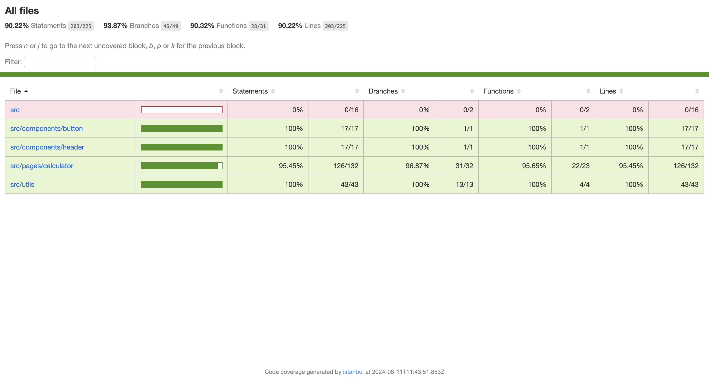

# iPhone Calculator Clone in React

This project is a pixel-perfect clone of the iPhone calculator, built using React and TypeScript. The goal of this project is to replicate the user experience and functionality of the original iPhone calculator, including its sleek design, responsive interface, and smooth user interactions.

### Live Demo

Check out the live working version of the iPhone Calculator Clone here: https://main--iphone-calculator-cline-in-react.netlify.app/


## Tech Stack

- **Vite**: Fast and lightweight build tool for modern web development.
- **ESLint**: Pluggable linting utility for JavaScript and TypeScript.
- **Prettier**: Opinionated code formatter to maintain consistent code style.
- **VS Code Settings**: Recommended settings for Visual Studio Code to enhance development experience.
- **TypeScript**: Typed superset of JavaScript for building scalable applications.
- **Pre-commit Hooks with Husky**: Automatically run linting and formatting checks before each commit.
- **Vitest**: Unit testing framework optimized for Vite projects.

**Additional Testing Dependencies**:

- **@testing-library/jest-dom**: Provides custom Jest matchers for asserting on DOM elements.
- **@testing-library/react**: Provides utilities for testing React components with a user-centric approach and seamless integration with Vitest, emphasizing accessibility and simulating user interactions.
- **@testing-library/user-event**: Simulates user events for testing React components.
- **jsdom**: A JavaScript implementation of the DOM for Node.js, used for testing React components in a simulated environment.

## How to Use

### Clone the Repository

To get started, clone the repository to your local machine:

```bash
git clone https://github.com/deepaksisodiya/iphone-calculator-clone-in-react.git
cd iphone-calculator-clone
npm install
```

### Run the Application

```bash
npm run dev
```

This will start the development server. You can view the application in your browser at http://localhost:5173/

### Running Unit Tests

```bash
npm run unit-tests
```


